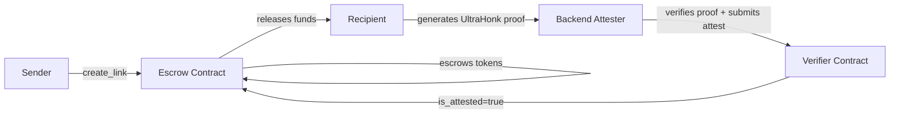

# Atreus

ZK-gated escrow payment links on Stellar. Create on-chain escrow links with XLM, share a secret URL, and let recipients claim funds by generating a zero-knowledge proof — without ever revealing the secret on-chain.

## What It Does

- **Wallet Dashboard** — View balance, all assets, and recent transactions. Create an instant non-custodial wallet (no browser extension required).
- **Send / Receive** — Send XLM to any Stellar address. Share your address with an explorer link.
- **Swap** — XLM → USDC/EURT via Stellar DEX path payments. Trustlines added automatically.
- **Payment Links** — Create escrow links secured by SHA-256 secrets and ZK proofs. Recipients claim funds by proving secret knowledge without revealing it.
- **Manage Assets** — Add trustlines for any Stellar asset.

## Architecture

```
Browser (ZK proof)  →  Backend (proof verification)  →  Soroban (on-chain settlement)
```

| Component | Stack | What it does |
|-----------|-------|-------------|
| `frontend/` | Next.js 15, React 19, Tailwind CSS | Wallet UI + payment link creation/claiming |
| `backend/` | Express, TypeScript, `bb.js` | ZK attestation service — verifies UltraHonk proofs off-chain, signs on-chain attestations |
| `contracts/` | Rust, Soroban SDK 22.0.0 | Escrow contract + VerifierContract (attestation oracle) |
| `circuits/` | Noir 1.0.0-beta.22 | Pedersen-based ZK proof circuit |

### ZK Architecture

Payment links use a real Noir circuit that proves knowledge of a link secret without revealing it. An UltraHonk proof is generated client-side via `@aztec/bb.js` and verified by a backend attester, which submits an on-chain attestation that the escrow contract checks before releasing funds.

The attester pattern is used because Soroban lacks native BN254 pairing host functions (BLS12-381 is available via CAP-0059, but this toolchain targets BN254). Once CAP-0074 ships native BN254 verification, the attester can be replaced with direct on-chain proof verification:



## Features

### Web Wallet
- **BIP39 mnemonic** (24 words) — recoverable across devices
- **Google OAuth** sign-in via `@react-oauth/google`
- **Anonymous wallet** — create instantly, no account needed
- **Wallet restore** — recover from seed phrase
- All signing via localStorage keypair — no browser extension required

### Payment Links
1. **Sender** generates a 32-byte secret → SHA-256 hash → `create_link()` on the escrow contract
2. **Recipient** opens the URL containing the secret → generates a ZK proof client-side → backend attester verifies the proof and submits an on-chain attestation → `claim_link()` checks both the secret hash and attestation → funds released

## Quick Start

```bash
# Frontend
cd frontend
npm install
cp .env.example .env.local   # add your contract IDs and Google Client ID
npm run dev                   # http://localhost:3000

# Backend
cd backend
cp .env.example .env          # set ATTESTER_SECRET_KEY
pnpm dev                      # http://localhost:3001

# Contracts
cd contracts
cargo test -p atreus-contract

# Circuits (via Docker)
docker compose run --rm compile
docker compose run --rm test
```

## Project Structure

```
atreus/
├── frontend/          Next.js 15 web app
├── backend/           Express API — ZK attestation service
├── contracts/         Soroban smart contracts (Rust)
├── circuits/          Noir ZK circuits
├── docs/              Architecture docs
├── Dockerfile         Node 20 + nargo 1.0.0-beta.22
├── docker-compose.yml
└── pnpm-workspace.yaml
```

## Environment Variables

**Frontend (`.env.local`):**
```
NEXT_PUBLIC_CONTRACT_ID=CCZSFPZ6XPZBUPBGQ5FRP5BMW5HKZIZNCWPLJAHNOWP4ZI7BZSMJDTCD
NEXT_PUBLIC_VERIFIER_CONTRACT_ID=CB3GJLFAGH2WQTQHSMAB7GABK4NC5Q74XDV2U7MWAYEKQV7YMBV2O7KD
NEXT_PUBLIC_TOKEN_ID=CDLZFC3SYJYDZT7K67VZ75HPJVIEUVNIXF47ZG2FB2RMQQVU2HHGCYSC
NEXT_PUBLIC_GOOGLE_CLIENT_ID=your-client-id.apps.googleusercontent.com
NEXT_PUBLIC_BACKEND_URL=http://localhost:3001
```

**Backend (`.env`):**
```
PORT=3001
ATTESTER_PUBLIC_KEY=<your attester public key>
ATTESTER_SECRET_KEY=<your attester secret key>
NEXT_PUBLIC_CONTRACT_ID=CCZSFPZ6XPZBUPBGQ5FRP5BMW5HKZIZNCWPLJAHNOWP4ZI7BZSMJDTCD
NEXT_PUBLIC_VERIFIER_CONTRACT_ID=CB3GJLFAGH2WQTQHSMAB7GABK4NC5Q74XDV2U7MWAYEKQV7YMBV2O7KD
SOROBAN_RPC_URL=https://soroban-testnet.stellar.org
HORIZON_URL=https://horizon-testnet.stellar.org
FRONTEND_URL=http://localhost:3000
```

## Deployed Contracts (Testnet)

| Contract | ID |
|----------|-----|
| VerifierContract | `CB3GJLFAGH2WQTQHSMAB7GABK4NC5Q74XDV2U7MWAYEKQV7YMBV2O7KD` |
| AtreusContract | `CCZSFPZ6XPZBUPBGQ5FRP5BMW5HKZIZNCWPLJAHNOWP4ZI7BZSMJDTCD` |

## Pages

| Route | Feature |
|-------|---------|
| `/` | Landing page |
| `/wallet` | Create / restore wallet |
| `/dashboard` | Balance, assets, transactions |
| `/send` | Send XLM |
| `/receive` | Receive — copy address |
| `/swap` | XLM → token via Stellar DEX |
| `/assets` | Add trustlines |
| `/create` | Create payment link |
| `/claim` | Claim payment link |
| `/activity` | Transaction history |
| `/analytics` | Wallet analytics |
| `/profile` | User profile |
| `/security` | Security settings |
| `/settings` | Network, address book, notifications |

## Design

Dark theme with Tailwind CSS and lucide-react icons. Reusable layout components in `frontend/src/components/`. Navigation items centralized in `frontend/src/constants/navigation.ts`.

## Docs

- [Frontend Walkthrough](./frontend/walkthrough/allwalkthrough.md)
- [Contracts Walkthrough](./contracts/walkthrough/allwalkthrough.md)
- [Circuits Walkthrough](./circuits/walkthrough/allwalkthrough.md)

## License

MIT
