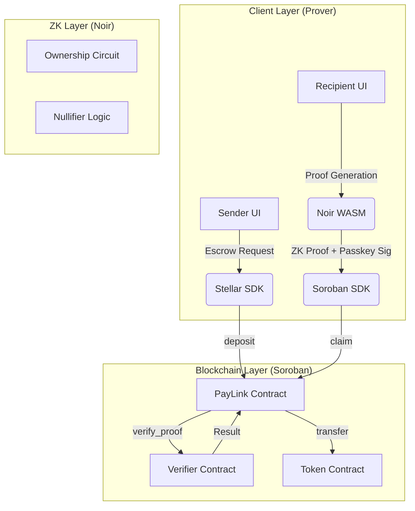

# System Architecture: ZK-PayLink

## High-Level Architecture
ZK-PayLink consists of three main layers: the Frontend (Prover), the Blockchain (Escrow & Verifier), and the ZK-Circuits (Logic).

## Data Flow: Link Claiming
1.  **Recipient** opens the link containing the `secret` in the URL fragment.
2.  **Frontend** initializes the `Noir` WASM prover and `Barretenberg` backend.
3.  **Recipient** authenticates via **Passkey**.
4.  **Frontend** generates a **ZK Proof**:
    - **Private Input**: `secret`
    - **Public Inputs**: `link_hash`, `recipient_address`, `nullifier`
5.  **Frontend** calls the `claim_link` function on the **PayLink Contract**.
6.  **PayLink Contract** forwards the proof to the **Verifier Contract**.
7.  **Verifier Contract** performs the math to ensure `hash(secret) == link_hash` and the proof is valid.
8.  **PayLink Contract** checks if the `nullifier` has been used (double-claim prevention).
9.  **PayLink Contract** triggers the `Token Contract` to transfer funds to the `recipient_address`.

## Component Interaction
- **Stellar SDK**: Used for building and signing transactions (XLM/Assets).
- **Noir WASM**: Compiles the `main.nr` circuit and generates proofs in the browser.
- **Passkey (WebAuthn)**: Provides a secondary layer of authorization, ensuring the claim is bound to a specific hardware device.
- **Soroban Verifier**: A specialized contract generated or inspired by the Noir `UltraVerifier` template, adapted for Soroban's environment.

## Wallet Onboarding Strategies

The core UX challenge is onboarding a web2 user without requiring them to understand seed phrases, browser extensions, or existing wallets. We are evaluating three approaches:

### 1. Link-as-Wallet
Generate a Stellar keypair and encode the secret key into the URL fragment (e.g., `https://atreus.app/c#<secret>`). Whoever holds the URL controls the funds.

- **Pros**: Dead simple — no auth required to claim.
- **Cons**: Custodial-in-disguise — anyone who intercepts the link controls the assets. No recovery if the link is lost. No persistent identity.

### 2. Email Auth Wallet
Derive a Stellar keypair deterministically from email OAuth (Google Sign-In). The user authenticates with their email provider, and the wallet is derived from the OAuth identity. Same wallet every time.

- **Pros**: Familiar UX (Sign in with Google). Non-custodial (keys derived client-side). Persistent identity across sessions.
- **Cons**: Ties wallet to a centralized identity provider. Requires OAuth flow before claiming.

### 3. Passkey Wallet
Use WebAuthn to generate and store the keypair on the user's device (hardware-backed). The private key never leaves the device — signing happens via biometrics (Touch ID / Face ID).

- **Pros**: No password, no provider dependency. Hardware-grade security. Works offline. Cross-device via iCloud Keychain / Google Password Manager.
- **Cons**: Tied to the user's device/ecosystem. Requires WebAuthn API support. Slightly less familiar UX than email.

### Decision
The current architecture leans toward **Passkey Wallet** for the MVP, combined with **ZK proofs** for privacy-preserving link claims. Email auth remains a candidate for future iterations to lower the onboarding barrier further.
