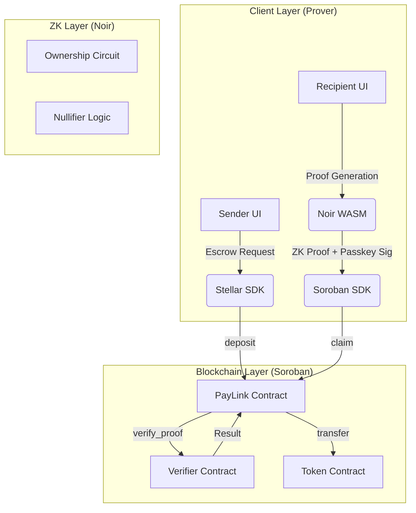

# System Architecture: ZK-PayLink

## High-Level Architecture
ZK-PayLink consists of three main layers: the Frontend (Prover), the Blockchain (Escrow & Verifier), and the ZK-Circuits (Logic).

## Data Flow: Link Claiming
1.  **Recipient** opens the link containing the `secret` in the URL fragment.
2.  **Frontend** initializes the `Noir` WASM prover and `Barretenberg` backend.
3.  **Recipient** authenticates via **Passkey**.
4.  **Frontend** generates a **ZK Proof**:
    - **Private Input**: `secret`
    - **Public Inputs**: `link_hash`, `recipient_address`, `nullifier`
5.  **Frontend** calls the `claim_link` function on the **PayLink Contract**.
6.  **PayLink Contract** forwards the proof to the **Verifier Contract**.
7.  **Verifier Contract** performs the math to ensure `hash(secret) == link_hash` and the proof is valid.
8.  **PayLink Contract** checks if the `nullifier` has been used (double-claim prevention).
9.  **PayLink Contract** triggers the `Token Contract` to transfer funds to the `recipient_address`.

## Component Interaction
- **Stellar SDK**: Used for building and signing transactions (XLM/Assets).
- **Noir WASM**: Compiles the `main.nr` circuit and generates proofs in the browser.
- **Passkey (WebAuthn)**: Provides a secondary layer of authorization, ensuring the claim is bound to a specific hardware device.
- **Soroban Verifier**: A specialized contract generated or inspired by the Noir `UltraVerifier` template, adapted for Soroban's environment.
