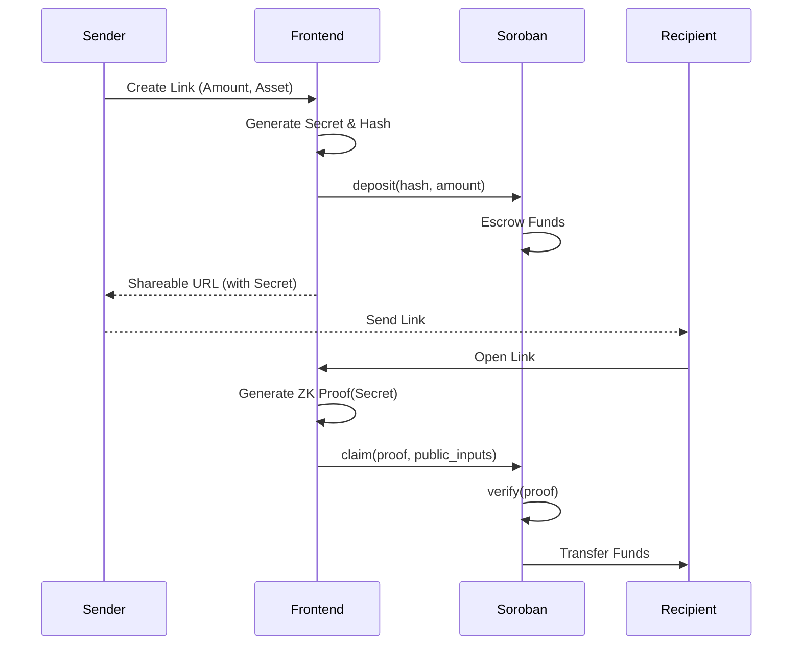

# Architecture Overview

ZK-PayLink leverages the Stellar network's Soroban smart contracts and Noir Zero-Knowledge proofs to provide a secure and private payment link service.

## Components

### 1. Frontend (Next.js)
- **Link Creation**: Generates a temporary secret, hashes it, and sends funds to the escrow contract.
- **Link Claiming**: Receives the link secret, generates a ZK proof of knowledge, and submits the claim to Soroban.
- **Passkey Integration**: Uses WebAuthn to secure the claim process.

### 2. Smart Contracts (Soroban)
- **PayLink Contract**: Manages deposits, tracks link hashes, and releases funds upon valid proof/preimage submission.
- **Verifier Contract**: A stateless contract that verifies ZK proofs generated by the frontend.

### 3. ZK Circuits (Noir)
- **Ownership Circuit**: Proves that `hash(secret) == link_hash` without revealing `secret`.
- **Authorization Circuit**: Proves that a claim is signed by a valid Passkey registered for that link.

## Data Flow

## ZK Proof Lifecycle
1. **Setup**: The Noir circuit is compiled to generate the verification key (deposited in Soroban).
2. **Witness Generation**: The frontend takes the link secret and any private inputs.
3. **Proving**: The `barretenberg` backend in the browser generates a proof.
4. **Verification**: Soroban's `verifier-contract` checks the proof against the verification key and public inputs.
