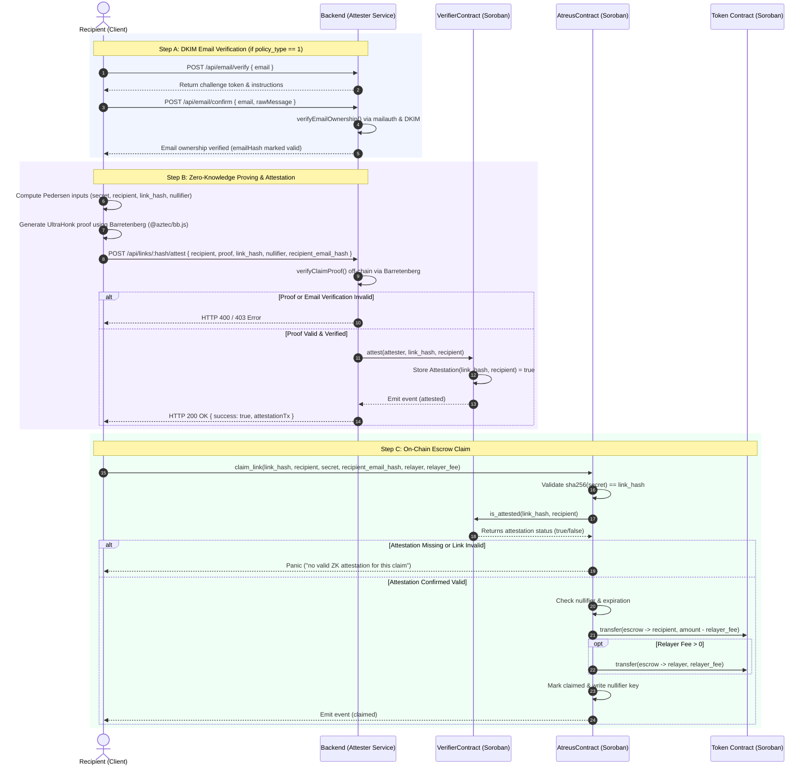

# Atreus — Architecture

> Google-login wallet + privacy-preserving payment links with programmable ZK rules on Stellar.
> No seed phrase required. No identity leak. No double-claim. No proof sniping.

---

## 1. Product Overview

Atreus is a **TipLink-style wallet on Stellar** with an integrated **ZK-powered payment link system**.

### Core Product (Wallet)
- **Google OAuth / Passkey Login**: Direct Google authentication driving a deterministic BIP-39 mnemonic & Ed25519 Stellar keypair.
- **Local Storage Key Management**: Keypair and 24-word seed phrase generated and saved locally in browser `localStorage`.
- **Multi-Wallet Support**: Connect via local Google-derived keypair or external wallets (Freighter, xBull, Lobstr).
- **Stellar Asset Operations**: Send/receive XLM and custom assets, view account history, and swap tokens.
- **Backup & Recovery**: 24-word BIP-39 mnemonic export and import for full self-custody recovery.

### Add-on Feature (ZK Payment Links)
- **Programmable Escrow**: Escrow XLM or Stellar assets inside Soroban smart contracts with custom conditions.
- **Zero-Knowledge Proofs**: Recipient proves knowledge of link secret without revealing it using Noir + Barretenberg UltraHonk proofs.
- **Attestation-Oracle Verification**: Proof is verified off-chain by an attester service and recorded on-chain via `VerifierContract`.
- **DKIM Email-Restricted Claim**: Optional email ownership verification using DKIM signatures before link attestation.
- **Double-Claim & Front-Running Guards**: Nullifiers prevent replaying claims, while binding recipient addresses into ZK public inputs prevents MEV proof sniping.

---

## 2. Tech Stack

| Layer | Technology | Purpose |
|-------|-----------|---------|
| **Frontend** | Next.js 15, React 18, Tailwind CSS | Wallet UI, link creation, claim interface |
| **Wallet Auth** | Google OAuth + BIP-39 Mnemonic | Google sign-in yielding BIP-39 seed phrase & Ed25519 keypair |
| **Local Storage** | Browser `localStorage` (`atreus_wallet`) | Client-side encrypted key management |
| **Blockchain SDK** | `@stellar/stellar-sdk`, `@stellar/freighter-api` | Transaction building, wallet adapter layer, Stellar Horizon integration |
| **Smart Contracts** | Rust, Soroban SDK 22.0.0 | Link escrow contract (`AtreusContract`) & attestation registry (`VerifierContract`) |
| **ZK Circuits** | Noir (`circuits/src/main.nr`) | Zero-knowledge proof circuit definitions |
| **ZK Proving** | Barretenberg (`@aztec/bb.js`, `@noir-lang/noir_js`) | Client-side UltraHonk proof generation in browser WASM |
| **Hash Primitive** | Pedersen Hash (`std::hash::pedersen_hash`) | ZK-friendly hash function for secret commitments and nullifiers |
| **Attestation Oracle** | Node.js / Express, Barretenberg | Off-chain UltraHonk proof verification & on-chain attestation submission |
| **Email Verification** | DKIM (`mailauth`, RFC 822 parsing) | Cryptographic DKIM email ownership verification for email-restricted links |
| **Backend API** | Express, TypeScript, Pino | Link attestation API, batch processing, email verification service |

---

## 3. System Architecture

```
┌──────────────────────────────────────────────────────────────────┐
│                         Browser Client                           │
│                                                                  │
│  ┌────────────────────────┐         ┌─────────────────────────┐  │
│  │   Google OAuth / Auth  │         │  Ed25519 Local Wallet   │  │
│  └───────────┬────────────┘         └────────────┬────────────┘  │
│              │                                   │               │
│              ▼                                   ▼               │
│    BIP-39 Mnemonic Seed                 Stellar Transaction      │
│  (Saved in localStorage)                    Builder              │
│              │                                   │               │
│              └─────────────────┬─────────────────┘               │
│                                │                                 │
│                                ▼                                 │
│             Noir WASM Prover (@aztec/bb.js)                      │
│             • Secret & Recipient inputs                          │
│             • Pedersen Hash commitments                          │
│             • Generates UltraHonk Proof                          │
└────────────────────────────────┬─────────────────────────────────┘
                                 │
                 ┌───────────────┴───────────────┐
                 │                               │
                 ▼                               ▼
┌────────────────────────────────┐ ┌───────────────────────────────┐
│        Backend Oracle          │ │       Stellar Network         │
│                                │ │          (Soroban)            │
│  ┌──────────────────────────┐  │ │                               │
│  │   DKIM Email Verifier    │  │ │  ┌─────────────────────────┐  │
│  │   (mailauth / RFC822)    │  │ │  │   AtreusContract        │  │
│  └───────────┬──────────────┘  │ │  │   • create_link()       │  │
│              │                 │ │  │   • claim_link()        │  │
│              ▼                 │ │  │   • refund_link()       │  │
│  ┌──────────────────────────┐  │ │  └────────────┬────────────┘  │
│  │  Barretenberg Off-Chain  │  │ │               │               │
│  │    Proof Verifier        │  │ │               │ is_attested() │
│  └───────────┬──────────────┘  │ │               ▼               │
│              │                 │ │  ┌─────────────────────────┐  │
│              ▼                 │ │  │    VerifierContract     │  │
│  submitAttestation()           │ │  │    • attest()           │  │
│  (Signed by Attester key) ─────┼─┼─►│    • is_attested()      │  │
└────────────────────────────────┘ │  └─────────────────────────┘  │
                                   └───────────────────────────────┘
```

---

## 4. Wallet Architecture

### Google OAuth & BIP-39 Key Derivation

Atreus provides a friction-free onboarding flow without sacrificing self-custody:

```
Google Sign-In / OAuth
        │
        ▼
JWT / OAuth Credential
        │
        ▼
BIP-39 Mnemonic Generation (24 words)
        │
        ▼
Ed25519 Keypair (Stellar Address)
        │
        ▼
Stored in localStorage (`atreus_wallet`)
```

1. **Authentication**: User logs in with Google OAuth via `@react-oauth/google`.
2. **Key Generation**: The client generates a 24-word BIP-39 mnemonic phrase (`bip39.generateMnemonic(256)`).
3. **Seed Derivation**: The 512-bit seed (`bip39.mnemonicToSeed`) yields a raw 32-byte Ed25519 key for `Keypair.fromRawEd25519Seed(...)`.
4. **Local Persistence**: Public key, secret key, mnemonic, and email are saved in `localStorage` under `atreus_wallet`.
5. **Self-Custody & Backup**:
   - The user can reveal and export their 24-word recovery phrase at any time.
   - If local storage is cleared or a new device is used, the user can restore full wallet access via the seed phrase.

### Transaction Signing Options

- **Local Wallet**: Signed client-side using the local Ed25519 secret key.
- **External Web3 Wallets**: Integrates with Freighter (`@stellar/freighter-api`), xBull, and Lobstr wallet extensions.

---

## 5. Smart Contract Design

### AtreusContract (`contracts/atreus-contract/src/lib.rs`)

Manages escrow funding, claim logic, and refund timeouts.

```rust
#[contracttype]
pub struct LinkInfo {
    pub creator: Address,       // Address that funded the link
    pub amount: i128,           // Escrow amount (in stroops)
    pub asset: Address,         // Token asset contract address
    pub policy_type: u32,       // 0 = secret knowledge, 1 = email-restricted
    pub policy_params: Bytes,   // Policy metadata (e.g. recipient_email_hash)
    pub expires_at: u64,        // Expiration timestamp
    pub claimed: bool,          // Claim status flag
}

pub fn create_link(
    env: Env,
    id: BytesN<32>,
    policy_type: u32,
    policy_params: Bytes,
    amount: i128,
    asset: Address,
    expiry: u64,
    sender: Address,
);

pub fn claim_link(
    env: Env,
    link_hash: BytesN<32>,
    recipient: Address,
    secret: BytesN<32>,
    recipient_email_hash: BytesN<32>,
    relayer_address: Address,
    relayer_fee: i128,
);

pub fn refund_link(
    env: Env,
    link_hash: BytesN<32>,
);
```

**Key Execution Logic in `claim_link`**:
1. **Secret Hash Check**: Validates `sha256(secret) == link_hash`.
2. **Email Policy Check**: If `policy_type == 1`, verifies `policy_params == recipient_email_hash`.
3. **ZK Attestation Check**: Invokes `VerifierContract.is_attested(link_hash, recipient)` cross-contract. Rejects claim if `false`.
4. **Nullifier & Expiry Check**: Ensures `expires_at` is in the future and `sha256(link_hash)` nullifier key has not been consumed.
5. **Asset Transfer**: Transfers tokens to recipient (minus optional relayer fee for gasless claims).

---

### VerifierContract (`contracts/verifier-contract/src/lib.rs`)

Stores verification parameters and attestation states issued by the trusted attester service.

```rust
#[contracttype]
pub enum DataKey {
    VerificationKey,
    Attester,
    Attestation(BytesN<32>, Address),
}

pub fn attest(
    env: Env,
    attester: Address,
    link_hash: BytesN<32>,
    recipient: Address,
);

pub fn is_attested(
    env: Env,
    link_hash: BytesN<32>,
    recipient: Address,
) -> bool;
```

**Attestation-Oracle Architecture**:
- Because native BN254 precompiles for UltraHonk verification inside Soroban VM are not yet deployed on Stellar mainnet, Atreus uses an **attestation-oracle pattern**.
- The real UltraHonk proof is generated client-side and verified off-chain by the backend attester using Barretenberg.
- Upon valid proof verification, the attester submits `attest()`, recording `Attestation(link_hash, recipient) = true` on-chain.

---

## 6. ZK Circuit Design (Noir)

### Circuit Definition (`circuits/src/main.nr` & `circuits/src/policies/secret.nr`)

The Noir zero-knowledge circuit proves knowledge of the link secret without revealing it, bound to a specific recipient address.

```rust
// circuits/src/main.nr
mod policies;

fn main(
    secret: Field,            // Link secret (private)
    recipient: pub Field,     // Recipient address (public)
    link_hash: pub Field,     // pedersen_hash([secret]) (public)
    nullifier: pub Field,     // pedersen_hash([secret, recipient]) (public)
) {
    policies::secret::verify(secret, recipient, link_hash, nullifier);
}
```

```rust
// circuits/src/policies/secret.nr
pub fn verify(
    secret: Field,
    recipient: Field,
    link_hash: Field,
    nullifier: Field,
) {
    // Constraint 1: Prove secret knowledge via Pedersen commitment
    let computed_hash = std::hash::pedersen_hash([secret]);
    assert(computed_hash == link_hash);

    // Constraint 2: Nullifier binds secret + recipient
    let computed_nullifier = std::hash::pedersen_hash([secret, recipient]);
    assert(computed_nullifier == nullifier);
}
```

### Input Parameters & Constraints

- **Private Input**:
  - `secret`: 32-byte secret value embedded in the claim link URL fragment.
- **Public Inputs**:
  - `recipient`: Stellar public key encoded as a BN254 scalar field element.
  - `link_hash`: Pedersen hash commitment of the secret (`pedersen_hash([secret])`).
  - `nullifier`: Pedersen hash combining secret and recipient (`pedersen_hash([secret, recipient])`).
- **Constraints**:
  1. `pedersen_hash([secret]) == link_hash`
  2. `pedersen_hash([secret, recipient]) == nullifier`

---

## 7. Attestation-Oracle Flow

The attestation-oracle flow guarantees zero-knowledge privacy while ensuring compatibility with Soroban execution:

```
Client (Browser)                 Backend Attester              VerifierContract
       │                                │                             │
       │  1. Generate UltraHonk proof   │                             │
       │     using @aztec/bb.js WASM    │                             │
       │                                │                             │
       │  2. POST /api/links/:hash/attest                             │
       │     (proof, recipient,         │                             │
       │      link_hash, nullifier)     │                             │
       │───────────────────────────────►│                             │
       │                                │                             │
       │                                │  3. verifyClaimProof()      │
       │                                │     (Barretenberg off-chain)│
       │                                │                             │
       │                                │  4. Submit attest() tx      │
       │                                │────────────────────────────►│
       │                                │                             │
       │                                │  5. Record attestation      │
       │                                │◄────────────────────────────│
       │  6. 200 OK (attestationTx)     │                             │
       │◄───────────────────────────────│                             │
```

1. **Client Proving**: The browser loads the circuit bytecode (`secret.json`) and generates an UltraHonk proof using `@aztec/bb.js`.
2. **Attest Request**: Client sends `POST /api/links/:hash/attest` with the proof, recipient address, and public Pedersen field values (`link_hash`, `nullifier`).
3. **Off-Chain Verification**: Backend calls `verifyClaimProof(...)`, executing Barretenberg verification against the public inputs.
4. **On-Chain Attestation**: If valid, the backend attester signs and submits `VerifierContract.attest(attester, link_hash, recipient)`.
5. **Contract Record**: `VerifierContract` sets `Attestation(link_hash, recipient) = true` in persistent storage.

---

## 8. DKIM Email Verification Flow

For email-restricted payment links (`policy_type == 1`), the backend enforces cryptographic email ownership before attesting ZK proofs (`backend/src/routes/email.ts` & `backend/src/lib/dkim.ts`).

```
Client (Recipient)               Backend Server                 Email Provider
       │                                │                             │
       │  1. POST /api/email/verify     │                             │
       │     { email: "user@domain" }   │                             │
       │───────────────────────────────►│                             │
       │                                │                             │
       │  2. Challenge Token issued     │                             │
       │     (emailHash stored)         │                             │
       │◄───────────────────────────────│                             │
       │                                                              │
       │  3. Send email containing challenge token ──────────────────►│
       │                                                              │
       │  4. POST /api/email/confirm                                  │
       │     { email, rawMessage }                                    │
       │───────────────────────────────►│                             │
       │                                │                             │
       │                                │  5. verifyEmailOwnership()  │
       │                                │     • Parse RFC 822         │
       │                                │     • Verify DKIM signature │
       │                                │     • Align From header     │
       │                                │     • Check challenge token │
       │                                │                             │
       │  6. Email Marked Verified      │                             │
       │◄───────────────────────────────│                             │
```

### Protocol Steps

1. **Challenge Request** (`POST /api/email/verify`):
   - Client sends target email address.
   - Backend computes `emailHash = sha256(email)` and issues a unique challenge token with an expiration timestamp.
2. **Email Dispatch & Signing**:
   - The user sends an email containing the challenge token in the subject or body.
   - The sending email provider signs the message headers and body using DKIM (`DKIM-Signature:` header).
3. **DKIM Verification** (`POST /api/email/confirm`):
   - Client submits `{ email, rawMessage }` containing the raw RFC 822 email source.
   - `verifyEmailOwnership` parses headers, verifies the DKIM public key signature via `mailauth`, checks domain alignment, and validates the presence of the challenge token.
4. **Attestation Gate**:
   - When claiming an email-restricted link, `POST /api/links/:hash/attest` requires `recipient_email_hash`.
   - The backend checks `isEmailHashVerified(recipient_email_hash)` before issuing the on-chain attestation.

---

## 9. Full Claim Flow Sequence Diagram

The following diagram illustrates the complete end-to-end claim lifecycle, combining DKIM email verification, client ZK proof generation, backend oracle attestation, and Soroban contract execution.


```mermaid
sequenceDiagram
    autonumber
    actor Recipient as Recipient (Client)
    participant Backend as Backend (Attester Service)
    participant Verifier as VerifierContract (Soroban)
    participant Atreus as AtreusContract (Soroban)
    participant Token as Token Contract (Soroban)

    rect rgb(240, 245, 255)
    note over Recipient, Backend: Step A: DKIM Email Verification (if policy_type == 1)
    Recipient->>Backend: POST /api/email/verify { email }
    Backend-->>Recipient: Return challenge token & instructions
    Recipient->>Backend: POST /api/email/confirm { email, rawMessage }
    Backend->>Backend: verifyEmailOwnership() via mailauth & DKIM
    Backend-->>Recipient: Email ownership verified (emailHash marked valid)
    end

    rect rgb(245, 240, 255)
    note over Recipient, Backend: Step B: Zero-Knowledge Proving & Attestation
    Recipient->>Recipient: Compute Pedersen inputs (secret, recipient, link_hash, nullifier)
    Recipient->>Recipient: Generate UltraHonk proof using Barretenberg (@aztec/bb.js)
    Recipient->>Backend: POST /api/links/:hash/attest { recipient, proof, link_hash, nullifier, recipient_email_hash }
    Backend->>Backend: verifyClaimProof() off-chain via Barretenberg
    alt Proof or Email Verification Invalid
        Backend-->>Recipient: HTTP 400 / 403 Error
    else Proof Valid & Verified
        Backend->>Verifier: attest(attester, link_hash, recipient)
        Verifier->>Verifier: Store Attestation(link_hash, recipient) = true
        Verifier-->>Backend: Emit event (attested)
        Backend-->>Recipient: HTTP 200 OK { success: true, attestationTx }
    end
    end

    rect rgb(240, 255, 245)
    note over Recipient, Token: Step C: On-Chain Escrow Claim
    Recipient->>Atreus: claim_link(link_hash, recipient, secret, recipient_email_hash, relayer, relayer_fee)
    Atreus->>Atreus: Validate sha256(secret) == link_hash
    Atreus->>Verifier: is_attested(link_hash, recipient)
    Verifier-->>Atreus: Returns attestation status (true/false)
    alt Attestation Missing or Link Invalid
        Atreus-->>Recipient: Panic ("no valid ZK attestation for this claim")
    else Attestation Confirmed Valid
        Atreus->>Atreus: Check nullifier & expiration
        Atreus->>Token: transfer(escrow -> recipient, amount - relayer_fee)
        opt Relayer Fee > 0
            Atreus->>Token: transfer(escrow -> relayer, relayer_fee)
        end
        Atreus->>Atreus: Mark claimed & write nullifier key
        Atreus-->>Recipient: Emit event (claimed)
    end
    end
```

---

## 10. Security Model

### Threat: Proof Sniping & Front-Running (MEV)
* **Risk**: An attacker inspects mempool traffic and steals a claim proof to substitute their own address.
* **Mitigation**: The recipient's Stellar address is bound directly inside the Noir ZK circuit as a public input (`recipient`). A proof generated for Recipient A is cryptographically invalid for Recipient B.

### Threat: Double-Claim Attack
* **Risk**: A recipient attempts to execute `claim_link` multiple times using the same valid proof or secret.
* **Mitigation**: Soroban contract derives a unique nullifier key `sha256(link_hash)` on first claim and writes it to persistent storage. Submitting an already-claimed link or reused nullifier immediately panics.

### Threat: Link Secret Exposure
* **Risk**: Interception of link secrets over network channels or server logs.
* **Mitigation**: Link secrets are transmitted via URL fragments (`#secret`), which are never sent to HTTP servers. ZK proof generation occurs entirely client-side in browser WASM.

### Threat: Account Loss & Custody
* **Risk**: Loss of Google OAuth access or third-party service downtime.
* **Mitigation**: Full self-custody via 24-word BIP-39 mnemonic phrase generated at wallet setup. Users retain total control over private keys and funds at all times.

---

## 11. References

- [Stellar Developer Documentation](https://developers.stellar.org/docs)
- [Soroban Smart Contracts Overview](https://developers.stellar.org/docs/build/smart-contracts/overview)
- [Noir Language & Toolchain Documentation](https://noir-lang.org/docs/)
- [Aztec Barretenberg Proving System](https://github.com/AztecProtocol/barretenberg)
- [DKIM Signatures RFC 6376 Specification](https://datatracker.ietf.org/doc/html/rfc6376)
- [TipLink Payment Links Reference](https://github.com/TipLink)
- [LOBSTR Wallet Integration](https://github.com/Lobstrco)
- [Soroswap Protocol & SDK](https://soroswap.finance)

