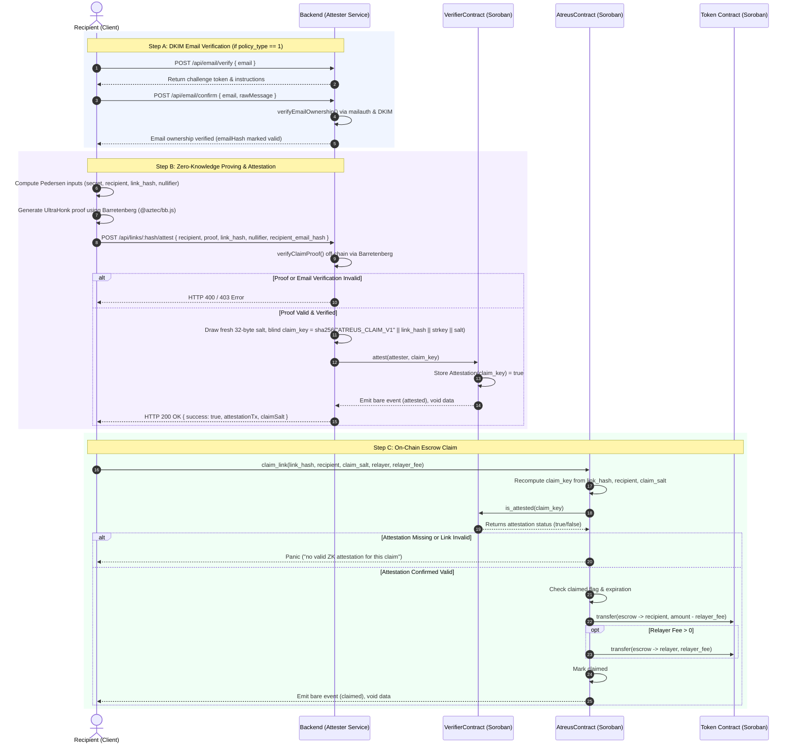

# Atreus — Architecture

> Google-login wallet + privacy-preserving payment links with programmable ZK rules on Stellar.
> No seed phrase required. No identity leak. No double-claim. No proof sniping.

---

## 1. Product Overview

Atreus is a **TipLink-style wallet on Stellar** with an integrated **ZK-powered payment link system**.

### Core Product (Wallet)
- **Google OAuth / Passkey Login**: Direct Google authentication driving a deterministic BIP-39 mnemonic & Ed25519 Stellar keypair.
- **Local Storage Key Management**: Keypair and 24-word seed phrase generated and saved locally in browser `localStorage`.
- **Multi-Wallet Support**: Connect via local Google-derived keypair or external wallets (Freighter, xBull, Lobstr).
- **Stellar Asset Operations**: Send/receive XLM and custom assets, view account history, and swap tokens.
- **Backup & Recovery**: 24-word BIP-39 mnemonic export and import for full self-custody recovery.

### Add-on Feature (ZK Payment Links)
- **Programmable Escrow**: Escrow XLM or Stellar assets inside Soroban smart contracts with custom conditions.
- **Zero-Knowledge Proofs**: Recipient proves knowledge of link secret without revealing it using Noir + Barretenberg UltraHonk proofs.
- **Attestation-Oracle Verification**: Proof is verified off-chain by an attester service and recorded on-chain via `VerifierContract`.
- **DKIM Email-Restricted Claim**: Optional email ownership verification using DKIM signatures before link attestation.
- **Batch Link Generation**: High-throughput CSV batch ingestion for creating up to 100 payment links in a single workflow.
- **Gasless Relayed Claims**: Recipient signs claim authorization while a relayer submits the transaction, covering network fees in exchange for a configurable relayer fee.
- **Double-Claim & Front-Running Guards**: Nullifiers prevent replaying claims, while binding recipient addresses into ZK public inputs prevents MEV proof sniping.

---

## 2. Tech Stack

| Layer | Technology | Purpose |
|-------|-----------|---------|
| **Frontend** | Next.js 15, React 18, Tailwind CSS | Wallet UI, link creation, claim interface |
| **Wallet Auth** | Google OAuth + BIP-39 Mnemonic | Google sign-in yielding BIP-39 seed phrase & Ed25519 keypair |
| **Local Storage** | Browser `localStorage` (`atreus_wallet`) | Client-side unencrypted JSON key storage |
| **Blockchain SDK** | `@stellar/stellar-sdk`, `@stellar/freighter-api` | Transaction building, wallet adapter layer, Stellar Soroban RPC integration |
| **Smart Contracts** | Rust, Soroban SDK 22.0.0 | Link escrow contract (`AtreusContract`) & attestation registry (`VerifierContract`) |
| **ZK Circuits** | Noir (`circuits/src/main.nr`) | Zero-knowledge proof circuit definitions |
| **ZK Proving** | Barretenberg (`@aztec/bb.js`, `@noir-lang/noir_js`) | Client-side UltraHonk proof generation in browser WASM |
| **Hash Primitive** | Pedersen Hash (`std::hash::pedersen_hash`) | ZK-friendly hash function for secret commitments and nullifiers |
| **Attestation Oracle** | Node.js / Express, Barretenberg | Off-chain UltraHonk proof verification & on-chain attestation submission |
| **Email Verification** | DKIM (`mailauth`, RFC 822 parsing) | Cryptographic DKIM email ownership verification for email-restricted links |
| **Batch Ingestion** | Node.js, Express, Pino | CSV processing engine for bulk escrow link creation (up to 100 rows per batch) |
| **Backend API** | Express, TypeScript, Pino | Link attestation API, batch processing, email verification service |

---

## 3. System Architecture

```
┌─────────────────────────────────────────────────────────────┐
│                    Browser (Next.js)                        │
│                                                             │
│  ┌──────────────┐    ┌──────────────────────────────────┐   │
│  │ Google OAuth │    │  Stellar Wallet (HKDF derived)   │   │
│  └──────┬───────┘    └──────────┬───────────────────────┘   │
│         │                       │                           │
│         │              ┌────────▼────────┐                  │
│         │              │  Soroban SDK    │                  │
│         │              │  (tx builder)   │                  │
│         │              └────────┬────────┘                  │
│         │                       │                           │
│  ┌──────▼───────────────────────▼───────────────────────┐   │
│  │              Noir WASM Prover (Barretenberg)         │   │
│  │  • Generate UltraHonk proofs in browser              │   │
│  │  • Poseidon hash (native BN254)                      │   │
│  └──────────────────────┬───────────────────────────────┘   │
└─────────────────────────┼───────────────────────────────────┘
                          │
                          ▼
┌─────────────────────────────────────────────────────────────┐
│                  Stellar (Soroban)                          │
│                                                             │
│  ┌─────────────────────┐    ┌───────────────────────────┐   │
│  │  AtreusContract     │    │  VerifierContract         │   │
│  │                     │    │  (rs-soroban-ultrahonk)   │   │
│  │  • create_link()    │◄───┤  • verify_proof()         │   │
│  │  • claim_link()     │    │  • VK set at deploy time  │   │
│  │  • refund_link()    │    └───────────────────────────┘   │
│  └────────┬────────────┘                                    │
│           │                                                 │
│  ┌────────▼────────────┐    ┌───────────────────────────┐   │
│  │  Token Contract     │    │  Soroswap DEX             │   │
│  │  (native / SAC)     │    │  (auto-swap on deposit)   │   │
│  └─────────────────────┘    └───────────────────────────┘   │
└─────────────────────────────────────────────────────────────┘
```

---

## 4. Wallet Architecture

### Google OAuth & BIP-39 Key Derivation

Atreus provides a friction-free onboarding flow without sacrificing self-custody:

```
Google Sign-In / OAuth
        │
        ▼
JWT / OAuth Credential
        │
        ▼
BIP-39 Mnemonic Generation (24 words)
        │
        ▼
Ed25519 Keypair (Stellar Address)
        │
        ▼
Stored in localStorage (`atreus_wallet`)
```

1. **Authentication**: User logs in with Google OAuth via `@react-oauth/google`.
2. **Key Generation**: The client generates a 24-word BIP-39 mnemonic phrase (`bip39.generateMnemonic(256)`).
3. **Seed Derivation**: The 512-bit seed (`bip39.mnemonicToSeed`) yields a raw 32-byte Ed25519 key for `Keypair.fromRawEd25519Seed(...)`.
4. **Local Persistence**: Public key, secret key, mnemonic, and email are saved in `localStorage` under `atreus_wallet`.
5. **Self-Custody & Backup**:
   - The user can reveal and export their 24-word recovery phrase at any time.
   - If local storage is cleared or a new device is used, the user can restore full wallet access via the seed phrase.

### Transaction Signing Options

- **Local Wallet**: Signed client-side using the local Ed25519 secret key.
- **External Web3 Wallets**: Integrates with Freighter (`@stellar/freighter-api`), xBull, and Lobstr wallet extensions.

---

## 5. Smart Contract Design

### AtreusContract (`contracts/atreus-contract/src/lib.rs`)

Manages escrow funding, claim logic, gasless relay payouts, and refund timeouts.

```rust
#[contracttype]
pub struct LinkInfo {
    pub creator: Address,       // Address that funded the link
    pub amount: i128,           // Escrow amount (in stroops)
    pub asset: Address,         // Token asset contract address
    pub policy_type: u32,       // 0 = secret knowledge, 1 = email-restricted
    pub policy_params: Bytes,   // Policy metadata (e.g. recipient_email_hash)
    pub expires_at: u64,        // Expiration timestamp
    pub claimed: bool,          // Claim status flag
}

pub fn create_link(
    env: Env,
    id: BytesN<32>,
    policy_type: u32,
    policy_params: Bytes,
    amount: i128,
    asset: Address,
    expiry: u64,
    sender: Address,
);

pub fn claim_link(
    env: Env,
    link_hash: BytesN<32>,
    recipient: Address,
    claim_salt: BytesN<32>,
    relayer_address: Address,
    relayer_fee: i128,
);

pub fn refund_link(
    env: Env,
    link_hash: BytesN<32>,
);
```

**Key Execution Logic in `claim_link`**:
1. **Email Policy Check**: If `policy_type == 1`, recomputes the blinded key `email_key = sha256("ATREUS_EMAIL_V1" || link_hash || recipient_strkey || policy_params || claim_salt)` and invokes `VerifierContract.is_email_attested(email_key)`.
2. **ZK Attestation Check**: Recomputes `claim_key = sha256("ATREUS_CLAIM_V1" || link_hash || recipient_strkey || claim_salt)` and invokes `VerifierContract.is_attested(claim_key)` cross-contract. Rejects claim if `false`. The attestation already proves secret knowledge, so `claim_link` takes no plaintext secret argument.
3. **Claimed & Expiry Check**: Ensures `expires_at` is in the future and the `claimed` flag is still `false`. Cross-transaction replay is handled by the VerifierContract nullifier registry (see §10); the escrow no longer writes a `sha256(link_hash)` nullifier entry.
4. **Relayer Fee & Asset Payout**:
   - Rejects negative relayer fees or fees exceeding total link amount (`relayer_fee < 0 || relayer_fee > amount`).
   - If `relayer_fee > 0`, transfers `relayer_fee` stroops to `relayer_address`.
   - Transfers `amount - relayer_fee` stroops to `recipient`.
5. **Unlinkable Event**: Emits a bare `("claimed",)` topic with void data — no link hash, recipient, amount, or fee. See §11.

---

### VerifierContract (`contracts/verifier-contract/src/lib.rs`)

Stores verification parameters and attestation states issued by the trusted attester service.

```rust
#[contracttype]
pub enum DataKey {
    VerificationKey,
    Attester,
    Attestation(BytesN<32>),       // blinded claim_key
    EmailAttestation(BytesN<32>),  // blinded email_key
    Nullifier(BytesN<32>),
}

pub fn attest(
    env: Env,
    attester: Address,
    claim_key: BytesN<32>,
);

pub fn is_attested(
    env: Env,
    claim_key: BytesN<32>,
) -> bool;
```

**Attestation-Oracle Architecture**:
- Atreus uses an **attestation-oracle pattern**, adopted before Soroban gained native BN254 host functions (CAP-0074, Protocol 25). It remains the verification gate today; moving UltraHonk verification on-chain is follow-up work — see §11.5.
- The real UltraHonk proof is generated client-side and verified off-chain by the backend attester using Barretenberg.
- Upon valid proof verification, the attester draws a fresh 32-byte salt, computes the blinded `claim_key`, and submits `attest()`, recording `Attestation(claim_key) = true` on-chain. Neither the arguments nor the storage key join `recipient` to `link_hash` — see §11.

---

## 6. ZK Circuit Design (Noir)

### Circuit Definition (`circuits/src/main.nr` & `circuits/src/policies/secret.nr`)

The Noir zero-knowledge circuit proves knowledge of the link secret without revealing it, bound to a specific recipient address.

```rust
// circuits/src/main.nr
mod policies;

fn main(
    secret: Field,            // Link secret (private)
    recipient: pub Field,     // Recipient address (public)
    link_hash: pub Field,     // pedersen_hash([secret]) (public)
    nullifier: pub Field,     // pedersen_hash([secret, recipient]) (public)
) {
    policies::secret::verify(secret, recipient, link_hash, nullifier);
}
```

```rust
// circuits/src/policies/secret.nr
pub fn verify(
    secret: Field,
    recipient: Field,
    link_hash: Field,
    nullifier: Field,
) {
    // Constraint 1: Prove secret knowledge via Pedersen commitment
    let computed_hash = std::hash::pedersen_hash([secret]);
    assert(computed_hash == link_hash);

    // Constraint 2: Nullifier binds secret + recipient
    let computed_nullifier = std::hash::pedersen_hash([secret, recipient]);
    assert(computed_nullifier == nullifier);
}
```

### Input Parameters & Constraints

- **Private Input**:
  - `secret`: 32-byte secret value embedded in the claim link URL fragment.
- **Public Inputs**:
  - `recipient`: Stellar public key encoded as a BN254 scalar field element.
  - `link_hash`: Pedersen hash commitment of the secret (`pedersen_hash([secret])`).
  - `nullifier`: Pedersen hash combining secret and recipient (`pedersen_hash([secret, recipient])`).
- **Constraints**:
  1. `pedersen_hash([secret]) == link_hash`
  2. `pedersen_hash([secret, recipient]) == nullifier`

### Field & Primitive Encoding Specifications

Both frontend (`frontend/src/lib/zk.ts`) and backend (`backend/src/lib/zk.ts`) follow strict field serialization rules:
- **BN254 Scalar Field Order (`FR_ORDER`)**: `21888242871839275222246405745257275088548364400416034343698204186575808495617`
- **Pedersen Hash Index**: `0` (matching Noir standard library `std::hash::pedersen_hash`).
- **Address Field Conversion**: Decoding Ed25519 public key bytes via `StrKey.decodeEd25519PublicKey` and converting big-endian to scalar field `BigInt % FR_ORDER`.
- **Secret Field Conversion**: Converting 32-byte raw secret to scalar field `BigInt % FR_ORDER`.

---

```
Sender                          Frontend                         Soroban
  │                                │                                │
  │  1. Sign in with Google        │                                │
  │───────────────────────────────►│                                │
  │                                │                                │
  │  2. Enter amount + policy      │                                │
  │     (e.g., "secret" rule)      │                                │
  │───────────────────────────────►│                                │
  │                                │                                │
  │  3. Generate secret (32 bytes) │  4. create_link(               │
  │     Compute link_hash =        │     id, policy_type,           │
  │     PoseidonHash(secret)       │     policy_params, amount,     │
  │                                │     asset, expiry, sender)     │
  │◄───────────────────────────────│───────────────────────────────►│
  │                                │                                │
  │  5. Share link                 │                                │
  │     (https://app/claim#secret) │                                │
  │───────────────────────────────►│                                │
```

### 7.1 Attestation-Oracle Flow

The attestation-oracle flow guarantees zero-knowledge privacy while ensuring compatibility with Soroban execution:

```
Recipient                        Frontend                         Soroban
  │                                │                                │
  │  1. Open link (URL#secret)     │                                │
  │───────────────────────────────►│                                │
  │                                │                                │
  │  2. Read secret from fragment  │                                │
  │     Derive recipient address   │                                │
  │                                │                                │
  │  3. Generate ZK proof          │                                │
  │     (bb.js in browser)         │                                │
  │───────────────────────────────►│                                │
  │                                │                                │
  │     (attest → claimSalt)       │                                │
  │◄───────────────────────────────│                                │
  │                                │                                │
  │                                │  4. claim_link(                │
  │                                │     link_hash, recipient,      │
  │                                │     claim_salt, relayer, fee)  │
  │                                │───────────────────────────────►│
  │                                │                                │
  │                                │  5. Recompute claim_key,       │
  │                                │     VerifierContract           │
  │                                │     .is_attested(claim_key)    │
  │                                │  6. Check claimed & expiry     │
  │                                │  7. Transfer funds             │
  │                                │◄───────────────────────────────│
  │◄───────────────────────────────│                                │
  │  8. Done!                      │                                │
```

1. **Client Proving**: The browser loads the circuit bytecode (`secret.json`) and generates an UltraHonk proof using `@aztec/bb.js`.
2. **Attest Request**: Client sends `POST /api/links/:hash/attest` with the proof, recipient address, and public Pedersen field values (`link_hash`, `nullifier`).
3. **Off-Chain Verification**: Backend calls `verifyClaimProof(...)`, executing Barretenberg verification against the public inputs.
4. **On-Chain Attestation**: If valid, the backend attester draws 32 fresh random bytes as `salt`, computes `claim_key = sha256("ATREUS_CLAIM_V1" || link_hash || recipient_strkey || salt)`, and submits `VerifierContract.attest(attester, claim_key)`.
5. **Contract Record**: `VerifierContract` sets `Attestation(claim_key) = true` in persistent storage. The attest response returns the salt to the recipient as `claimSalt`; the recipient passes it back into `claim_link`, which is the only way to recompute the key.

---

### 7.2 Batch Escrow Link Creation Subsystem (`backend/src/lib/batch.ts`)

For high-volume operations (e.g. payroll or promotional distributions), Atreus supports CSV batch processing:

```
Creator                          Backend API                   Stellar Soroban
   │                                  │                               │
   │  1. POST /api/links/batch        │                               │
   │     (creator, csv data)          │                               │
   │─────────────────────────────────►│                               │
   │  2. 202 Accepted (batchId)       │                               │
   │◄─────────────────────────────────│                               │
   │                                  │  3. Asynchronous Worker Loop  │
   │                                  │     • Parse & validate CSV    │
   │                                  │     • Generate 32-byte secret │
   │                                  │     • Compute sha256 linkHash │
   │                                  │                               │
   │                                  │  4. create_link() tx per row  │
   │                                  │──────────────────────────────►│
   │                                  │◄──────────────────────────────│
   │  5. GET /api/links/batch/:id     │                               │
   │     (Poll progress / results)    │                               │
   │─────────────────────────────────►│                               │
```

- **Batch Guardrails**: Maximum 100 rows per CSV batch (`MAX_BATCH_ROWS = 100`), max 1,000,000 token limit per batch.
- **CSV Headers Required**: `amount,optional_email,optional_memo`
- **Fault Tolerance**: Automatic retry mechanism with exponential backoff (up to 3 attempts per row).
- **Result Download**: Generates `results.csv` containing claim URLs with embedded hash secrets upon completion (`GET /api/links/batch/:batchId/results.csv`).

---

### 7.3 Gasless Relaying & Payout Execution

Atreus enables recipients to claim payment links without holding XLM for transaction fees:
1. **Relayer Authorization**: The recipient signs the invocation parameters including `relayer_address` and `relayer_fee`.
2. **Tx Submission**: The relayer node constructs, signs, and submits the Stellar transaction to Soroban RPC.
3. **Atomic Payout**: `AtreusContract.claim_link` atomically transfers `amount - relayer_fee` stroops to the recipient and `relayer_fee` stroops to the relayer.

---

## 8. DKIM Email Verification Flow

For email-restricted payment links (`policy_type == 1`), the backend enforces cryptographic email ownership before attesting ZK proofs (`backend/src/routes/email.ts` & `backend/src/lib/dkim.ts`).

```
Client (Recipient)               Backend Server                 Email Provider
       │                                │                             │
       │  1. POST /api/email/verify     │                             │
       │     { email: "user@domain" }   │                             │
       │───────────────────────────────►│                             │
       │                                │                             │
       │  2. Challenge Token issued     │                             │
       │     (emailHash stored)         │                             │
       │◄───────────────────────────────│                             │
       │                                                              │
       │  3. Send email containing challenge token ──────────────────►│
       │                                                              │
       │  4. POST /api/email/confirm                                  │
       │     { email, rawMessage }                                    │
       │───────────────────────────────►│                             │
       │                                │                             │
       │                                │  5. verifyEmailOwnership()  │
       │                                │     • Parse RFC 822         │
       │                                │     • Verify DKIM signature │
       │                                │     • Align From header     │
       │                                │     • Check challenge token │
       │                                │                             │
       │  6. Email Marked Verified      │                             │
       │◄───────────────────────────────│                             │
```

### Protocol Steps

1. **Challenge Request** (`POST /api/email/verify`):
   - Client sends target email address.
   - Backend computes `emailHash = sha256(email)` and issues a unique challenge token with an expiration timestamp.
2. **Email Dispatch & Signing**:
   - The user sends an email containing the challenge token in the subject or body.
   - The sending email provider signs the message headers and body using DKIM (`DKIM-Signature:` header).
3. **DKIM Verification** (`POST /api/email/confirm`):
   - Client submits `{ email, rawMessage }` containing the raw RFC 822 email source.
   - `verifyEmailOwnership` parses headers, verifies the DKIM public key signature via `mailauth`, checks domain alignment, and validates the presence of the challenge token.
4. **Attestation Gate**:
   - When claiming an email-restricted link, `POST /api/links/:hash/attest` requires `recipient_email_hash`.
   - The backend checks `isEmailHashVerified(recipient_email_hash)` before issuing the on-chain attestation.

---

## 9. Full Claim Flow Sequence Diagram

The following diagram illustrates the complete end-to-end claim lifecycle, combining DKIM email verification, client ZK proof generation, backend oracle attestation, and Soroban contract execution.


```mermaid
sequenceDiagram
    autonumber
    actor Recipient as Recipient (Client)
    participant Backend as Backend (Attester Service)
    participant Verifier as VerifierContract (Soroban)
    participant Atreus as AtreusContract (Soroban)
    participant Token as Token Contract (Soroban)

    rect rgb(240, 245, 255)
    note over Recipient, Backend: Step A: DKIM Email Verification (if policy_type == 1)
    Recipient->>Backend: POST /api/email/verify { email }
    Backend-->>Recipient: Return challenge token & instructions
    Recipient->>Backend: POST /api/email/confirm { email, rawMessage }
    Backend->>Backend: verifyEmailOwnership() via mailauth & DKIM
    Backend-->>Recipient: Email ownership verified (emailHash marked valid)
    end

    rect rgb(245, 240, 255)
    note over Recipient, Backend: Step B: Zero-Knowledge Proving & Attestation
    Recipient->>Recipient: Compute Pedersen inputs (secret, recipient, link_hash, nullifier)
    Recipient->>Recipient: Generate UltraHonk proof using Barretenberg (@aztec/bb.js)
    Recipient->>Backend: POST /api/links/:hash/attest { recipient, proof, link_hash, nullifier, recipient_email_hash }
    Backend->>Backend: verifyClaimProof() off-chain via Barretenberg
    alt Proof or Email Verification Invalid
        Backend-->>Recipient: HTTP 400 / 403 Error
    else Proof Valid & Verified
        Backend->>Backend: Draw fresh 32-byte salt, blind claim_key = sha256("ATREUS_CLAIM_V1" || link_hash || strkey || salt)
        Backend->>Verifier: attest(attester, claim_key)
        Verifier->>Verifier: Store Attestation(claim_key) = true
        Verifier-->>Backend: Emit bare event (attested), void data
        Backend-->>Recipient: HTTP 200 OK { success: true, attestationTx, claimSalt }
    end
    end

    rect rgb(240, 255, 245)
    note over Recipient, Token: Step C: On-Chain Escrow Claim
    Recipient->>Atreus: claim_link(link_hash, recipient, claim_salt, relayer, relayer_fee)
    Atreus->>Atreus: Recompute claim_key from link_hash, recipient, claim_salt
    Atreus->>Verifier: is_attested(claim_key)
    Verifier-->>Atreus: Returns attestation status (true/false)
    alt Attestation Missing or Link Invalid
        Atreus-->>Recipient: Panic ("no valid ZK attestation for this claim")
    else Attestation Confirmed Valid
        Atreus->>Atreus: Check claimed flag & expiration
        Atreus->>Token: transfer(escrow -> recipient, amount - relayer_fee)
        opt Relayer Fee > 0
            Atreus->>Token: transfer(escrow -> relayer, relayer_fee)
        end
        Atreus->>Atreus: Mark claimed
        Atreus-->>Recipient: Emit bare event (claimed), void data
    end
    end
```

---

## 10. Security Model

### Threat: Proof Sniping & Front-Running (MEV)
* **Risk**: An attacker inspects mempool traffic and steals a claim proof to substitute their own address.
* **Mitigation**: The recipient's Stellar address is bound directly inside the Noir ZK circuit as a public input (`recipient`). A proof generated for Recipient A is cryptographically invalid for Recipient B.

### Threat: Double-Claim Attack
* **Risk**: A recipient attempts to execute `claim_link` multiple times using the same valid proof or secret.
* **Mitigation**: Two layers. In the escrow contract, `claim_link` sets the `claimed` flag on `LinkInfo` and panics on any later claim of the same link; the escrow no longer derives a `sha256(link_hash)` nullifier key, which was a second, creator-derivable copy of the same signal. Across transactions and backend restarts, replay is stopped by the VerifierContract nullifier registry: the attester marks the circuit's `pedersen(secret, recipient)` nullifier as used before issuing an attestation, so a reused proof never gets a second attestation to spend.

### Threat: Link Secret Exposure
* **Risk**: Interception of link secrets over network channels or server logs.
* **Mitigation**: Link secrets are transmitted via URL fragments (`#secret`), which are never sent to HTTP servers. ZK proof generation occurs entirely client-side in browser WASM.

### Threat: Account Loss & Custody
* **Risk**: Loss of Google OAuth access or third-party service downtime.
* **Mitigation**: Full self-custody via 24-word BIP-39 mnemonic phrase generated at wallet setup. Users retain total control over private keys and funds at all times.

### Threat: Forged Email-Ownership Attestations
* **Risk**: Email-restricted links (policy_type=1) bind funds to an address. A forged DKIM attestation lets an attacker claim a link bound to someone else's inbox — a direct theft vector.
* **Mitigation — email-verification trust model** (backend/src/lib/dkim.ts, backend/src/lib/emailVerificationStore.ts):
  * **Strict pre-crypto validation** of the DKIM-Signature header (RFC 6376 + oracle hardening) before any DNS lookup: `v=1` only, strong algorithms only (`rsa-sha256`, `ed25519-sha256`), `d=`/`s=`/`h=` required with `h=` covering `From`, `b=`/`bh=` must be well-formed base64, canonicalization (`c=`) must be declared-valid, `x=`/`t=` expiry/freshness enforced with clock-skew tolerance, signatures older than the replay window (`EMAIL_DKIM_MAX_AGE_MS`, default 7 days) rejected, and `l=` body-length truncation (the classic append-attack) rejected when it is shorter than the actual body.
  * **Message identity**: exactly one `Message-ID` header is required — duplicates or absence reject the message.
  * **Domain alignment**: the passing signature's `d=` must cover the `From:` domain (exact or subdomain). A cryptographically valid signature from an unrelated domain (`evil.com`) signing a spoofed `From: victim@example.com` is rejected at both the verifier and ownership-check layers.
  * **Challenge-response**: ownership requires a server-issued 128-bit random nonce (challenge) embedded in the DKIM-signed message. Challenges are TTL-bound (`EMAIL_CHALLENGE_TTL_MS`, default 24h), **single-use** (consumed on success), capped at `EMAIL_CHALLENGE_MAX_ATTEMPTS` (default 5) failed confirmations before the challenge is burned, and starting a new challenge invalidates any prior verification for that hash.
  * **Abuse resistance**: sliding-window rate limits on both email endpoints (per-IP and per-email-hash), plus rejection of disposable email providers (`EMAIL_BLOCKED_DOMAINS` extends the default blocklist) on both `/api/email/verify` and `/api/email/confirm`.
  * **On-chain binding guarantee (backend)**: `attest_email` on `VerifierContract` is only invoked by `POST /api/links/:hash/attest` after the recipient email hash is marked verified — which is only reachable by fully validating a fresh, non-replayed, domain-aligned DKIM-signed challenge message. There is no code path that marks a hash verified without passing `verifyEmailOwnership`, and the verification record itself expires (`EMAIL_VERIFIED_TTL_MS`, default 1h).
  * **Privacy**: only `sha256(normalized email)` is stored server-side; raw emails and raw messages are never persisted.

---

## 11. Unlinkable Claiming — Threat Model (issue #118)

Before #118, a successful claim published a permanent, machine-readable record joining the link, the recipient, the amount, and the time. A link creator, or any third party indexing the ledger, could reconstruct who received what. This section lists what leaked, what the fix removes, and what still leaks.

### 11.1 Leak Enumeration (state before #118)

| # | Leak | Location | What the creator or a third party learned |
|---|------|----------|-------------------------------------------|
| 1 | `("claimed", link_hash)` event, data `(recipient, amount, relayer, fee)` | `contracts/atreus-contract/src/lib.rs::claim_link` | The complete claim record: which address claimed which link, the net payout, the relayer identity, the relayer fee, and the ledger close time. Anyone can subscribe to this stream. |
| 2 | Plaintext `secret` argument | `contracts/atreus-contract/src/lib.rs::claim_link` | The bearer secret appeared in the invocation arguments of every claim. Anyone who read the transaction envelope held the circuit's private witness and could generate a proof of their own. |
| 3 | `("attested", recipient)` event with data `link_hash`, `("eml_att", recipient)` with `(link_hash, email_hash)`, and the `Attestation(link_hash, recipient)` / `EmailAttestation(link_hash, recipient, email_hash)` storage keys | `contracts/verifier-contract/src/lib.rs::attest`, `::attest_email` | The recipient-to-link join, published before the claim transaction even landed. The storage keys were also probeable: guess a recipient address, read the entry. A payroll creator could test a known employee list. |
| 4 | `claimed` flag at storage key `link_hash`, and the nullifier entry at `sha256(link_hash)` | `contracts/atreus-contract/src/lib.rs::claim_link` | Both keys are derivable by anyone holding `link_hash`, and the creator always holds it. Free, unauthenticated `getLedgerEntry` polling showed whether and roughly when a link was claimed, with no transaction and no fee. |
| 5 | `GET /api/links/:hash` returned `creator`; `GET /api/analytics/links/:hash` served per-link view, initiation, and claim counts plus a 30-day series; `GET /api/analytics/summary` returned the full list of link hashes | `backend/src/routes/links.ts`, `backend/src/routes/analytics.ts` | Anyone holding a link hash learned the funder address and the claim timing, with no authentication. The summary endpoint handed out the hash list, so an attacker did not need a hash to start. |

### 11.2 Chosen Mechanism

| Measure | Leak removed |
|---------|--------------|
| `claim_link` drops the plaintext `secret` argument. The ZK attestation already proves secret knowledge, so re-checking `sha256(secret) == link_hash` on-chain added exposure and no security. | 2 |
| The `claimed`, `attested`, `eml_att`, `nullifier`, and `proof` events become bare topics — no link hash, recipient, amount, or fee, and void data. The one exception is `proof`, which keeps the proof length; `submit_proof` rejects anything but 2144 bytes, so that value is a constant and carries no information. `created` and `refunded` stay as they are, because both are creator-side actions the creator already knows. | 1, and the event half of 3 |
| Blinded attestations. The attester computes `claim_key = sha256("ATREUS_CLAIM_V1" \|\| link_hash \|\| recipient_strkey \|\| salt)` and `email_key = sha256("ATREUS_EMAIL_V1" \|\| link_hash \|\| recipient_strkey \|\| email_hash \|\| salt)` off-chain. VerifierContract stores only these keys, so neither the attest arguments nor the storage join a recipient to a link. | The storage half of 3 |
| The salt is 32 fresh random bytes per attestation, returned to the recipient as `claimSalt` and replayed into `claim_link`, which recomputes the key. Because the salt is unpredictable, a creator holding a candidate set of addresses cannot precompute keys and probe storage. | Candidate-set precomputation against 3 |
| The per-link nullifier entry at `sha256(link_hash)` is removed from the escrow. The `claimed` flag is the same-transaction double-claim guard, and cross-transaction replay protection stays where #114 put it: the VerifierContract nullifier registry, keyed by the circuit's `pedersen(secret, recipient)`. | One of the two pollable beacons in 4 |
| Backend: `GET /api/links/:hash` no longer returns `creator`, the per-link analytics endpoint is removed, and `GET /api/analytics/summary` is aggregate-only, with no `perLink` block and no link list. | 5 |

### 11.3 Residual Leaks

These remain after #118. They are stated here so nobody reads the change as full unlinkability.

1. **The claim transaction still names the link.** `claim_link` arguments carry `link_hash` and `recipient` in cleartext, and the invocation reads and writes the `LinkInfo` entry keyed by `link_hash`. An observer who parses full transaction metadata, not only events, can still perform the join. The change raises the cost from subscribing to an event stream to indexing every claim transaction's storage footprint. The same limit applies to `creator`: the `LinkInfo` ledger entry is world-readable through `getContractData` (see `backend/src/lib/stellar.ts::getLinkInfo`), so removing `creator` from the API response removes a convenience, not a confidentiality boundary.
2. **The bearer-secret limit is inherent.** The creator generated the link secret and keeps a copy. They can simulate a `claim_link` invocation at any time, for free, and a simulation that panics with `"already claimed"` tells them the link is spent. The `claimed` flag inside `LinkInfo` is also directly readable. So whether and when a link was claimed cannot be hidden from an **active** creator by any measure short of removing `link_hash` from the claim path entirely — see §11.5. What #118 removes is passive, free, push-delivered observation: the creator must now poll, and timing resolution degrades from the exact ledger to the polling interval.
3. **Amount and timing correlation.** The escrow pays out `amount - relayer_fee` in a public token transfer from the contract address to the recipient. A distinctive amount, or a claim during a quiet period, still identifies the recipient.
4. **The attester sees everything.** The oracle receives the recipient address, link hash, proof, and email hash off-chain, and it chooses the salt. This is already in the trust model — the oracle exists because Soroban cannot verify the BN254 proof in-contract today — but #118 does not shrink it.

### 11.4 Preserved Properties

- **Nullifier replay protection (#114)**: unchanged. The VerifierContract nullifier registry still records `pedersen(secret, recipient)` before an attestation is issued, with the backend cache as the fast path and the on-chain entry as the restart-safe fallback.
- **Email-restricted claims (#69/#72)**: unchanged in effect. DKIM ownership verification still gates attestation, and `claim_link` still enforces `policy_type == 1` through the verifier — now against the blinded `email_key` instead of the `(link_hash, recipient, email_hash)` triple.
- **Refundability**: unchanged. `refund_link` still pays the creator after expiry, and the `refunded` event keeps its payload.
- **Relayer-fee approval semantics**: unchanged. `recipient.require_auth()` authorizes the complete invocation, so the recipient's signature is still an explicit approval of `relayer_address` and `relayer_fee`.

### 11.5 Future Design: Merkle-Membership Circuit (not implemented)

Residual leak 1 exists only because `claim_link` needs `link_hash` to find the escrow entry. A Merkle-membership circuit removes that need. The contract keeps a Merkle root over all link commitments, and `create_link` inserts a commitment and updates the root. The circuit takes the root and the recipient-bound nullifier `pedersen(secret, recipient)` as public inputs, and the link commitment plus its authentication path as private inputs, proving "I know the secret behind some link in this tree" without naming which one. The claim transaction then carries only the nullifier and the payout target, so there is no link hash in the arguments, no entry keyed by a creator-known value, and nothing for the creator to poll. The anonymity set is every unclaimed link in the tree, and it grows as the contract is used. Soroban now has native BN254 host functions (CAP-0074, Protocol 25), so the proof can be verified inside the contract VM, which also retires the trusted attester and with it residual leak 4 and the whole salt mechanism. The costs are a per-claim inclusion proof of about `log2(n)` hashes and a fixed-denomination scheme, because residual leak 3 is otherwise untouched.

```
create_link ─► commitment = pedersen(secret, amount, asset)
                      │
                      ▼
       Merkle tree of link commitments ──► root (public, on-chain)
                                             │
claim_link(nullifier, recipient, proof) ─────┘
   public  : root, nullifier = pedersen(secret, recipient), recipient
   private : commitment, Merkle path
   ⇒ no link_hash anywhere in the claim transaction
```

---

## 12. References

- [Stellar Developer Documentation](https://developers.stellar.org/docs)
- [Soroban Smart Contracts Overview](https://developers.stellar.org/docs/build/smart-contracts/overview)
- [Noir Language & Toolchain Documentation](https://noir-lang.org/docs/)
- [Aztec Barretenberg Proving System](https://github.com/AztecProtocol/barretenberg)
- [DKIM Signatures RFC 6376 Specification](https://datatracker.ietf.org/doc/html/rfc6376)
- [TipLink Payment Links Reference](https://github.com/TipLink)
- [LOBSTR Wallet Integration](https://github.com/Lobstrco)
- [Soroswap Protocol & SDK](https://soroswap.finance)
