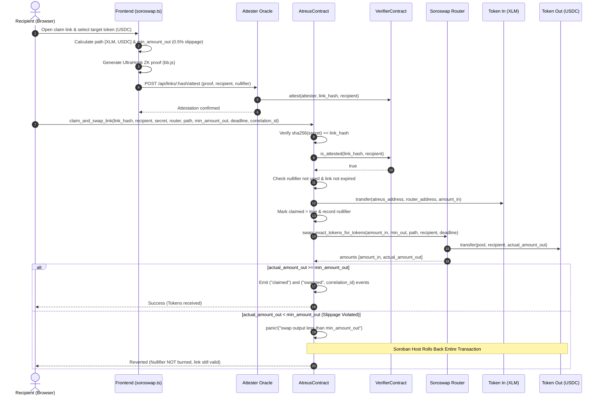

# Atreus — Atomic Claim-and-Swap Architecture

> Zero-Knowledge claim verification coupled with cross-contract DEX execution on Stellar (Soroban).
> Escrow in any Stellar asset; claim and settle directly into the recipient's desired token in a single atomic transaction.

---

## 1. Architecture Overview

Atreus allows payment link creators to escrow funds in a base asset (such as native XLM), while empowering recipients to claim and automatically swap those funds into their preferred asset (e.g., USDC, EURC) in a **single atomic transaction**.

This is accomplished via cross-contract calls between the **Atreus Contract** (`AtreusContract`) and the **Soroswap Router** (`SoroswapRouter`) on Soroban.

```
┌────────────────────────────────────────────────────────────────────────────────────────┐
│                                   CLIENT (Browser)                                     │
│  1. Enter secret / URL fragment                                                        │
│  2. Select target asset (e.g., USDC) & slippage tolerance (e.g., 0.5%)                 │
│  3. Fetch optimal route via soroswap.ts (Horizon / Soroswap API)                       │
│  4. Generate UltraHonk ZK proof & obtain attestation                                   │
│  5. Submit claim_and_swap_link tx                                                      │
└───────────────────────────────────────────┬────────────────────────────────────────────┘
                                            │
                                            ▼
┌────────────────────────────────────────────────────────────────────────────────────────┐
│                              STELLAR SOROBAN RUNTIME                                   │
│                                                                                        │
│  ┌──────────────────────────────────────────────────────────────────────────────────┐  │
│  │                                 AtreusContract                                   │  │
│  │                                                                                  │  │
│  │  1. Authenticate recipient (`recipient.require_auth()`)                          │  │
│  │  2. Verify secret hash: `sha256(secret) == link_hash`                            │  │
│  │  3. Verify ZK attestation via VerifierContract (`is_attested`)                   │  │
│  │  4. Verify email attestation if policy_type == 1 (`is_email_attested`)            │  │
│  │  5. Validate path: `path[0] == link_info.asset` & `path.len() >= 2`              │  │
│  │  6. Transfer escrowed tokens to Soroswap Router                                  │  │
│  │  7. Set `claimed = true` & write nullifier `sha256(link_hash)`                    │  │
│  │  8. Cross-contract call: `swap_exact_tokens_for_tokens`                           │  │
│  │  9. Assert `actual_amount_out >= min_amount_out` (panic! on slippage violation)   │  │
│  │ 10. Emit structured events & diagnostic logs with correlation ID                 │  │
│  └──────────────────┬─────────────────────────────────────────┬─────────────────────┘  │
│                     │                                         │                        │
│                     │ (cross-contract)                        │ (cross-contract)       │
│                     ▼                                         ▼                        │
│  ┌─────────────────────────────────────┐   ┌────────────────────────────────────────┐  │
│  │          VerifierContract           │   │            Soroswap Router             │  │
│  │                                     │   │                                        │  │
│  │  • is_attested(link_hash, recp)     │   │  • swap_exact_tokens_for_tokens(...)   │  │
│  │  • is_email_attested(...)           │   │  • Routes through liquidity pools      │  │
│  └─────────────────────────────────────┘   │  • Delivers target tokens to recipient │  │
│                                            └────────────────────────────────────────┘  │
└────────────────────────────────────────────────────────────────────────────────────────┘
```

### Sequence Flow



---

## 2. State Safety & Rollback Guarantees

A central challenge in decentralized payment links is **proof burning**: if a recipient's swap fails due to pool slippage or market movement, their one-time secret or ZK proof must not be consumed or permanently invalidated.

### Soroban's Native Transaction Rollback

Soroban transactions execute within an isolated VM state container. If any contract invocation during the transaction triggers a `panic!`, the Soroban host halts execution and discards all pending ledger modifications across all contracts invoked in that transaction:

1. **Nullifier Registry Protection**:
   - The nullifier key `sha256(link_hash)` is staged in storage during the claim phase.
   - When `panic!("swap output less than min_amount_out")` is executed, the storage write is reverted.
   - The nullifier remains **unregistered and unburned**.

2. **Link Status Restoration**:
   - `link_info.claimed` reverts from `true` to `false`.
   - The link remains active in persistent storage and can be claimed again immediately.

3. **Asset Protection**:
   - The token transfer from `AtreusContract` to the `SoroswapRouter` is reverted.
   - The escrowed balance remains securely in `AtreusContract`.

4. **Clean Failure Reporting**:
   - The recipient is presented with a clear explanation: the swap exceeded their slippage tolerance, no funds were lost, and they may retry with a higher slippage tolerance or claim the original escrowed asset.

### State Transition Matrix

| Step | State Before | Staged State | State on Slippage Panic (`revert`) | State on Success (`commit`) |
| :--- | :--- | :--- | :--- | :--- |
| **`link_info.claimed`** | `false` | `true` | `false` (reverted) | `true` |
| **Nullifier `sha256(link_hash)`** | `None` | `true` | `None` (reverted) | `true` |
| **Contract Asset Balance** | `100 XLM` | `0 XLM` | `100 XLM` (reverted) | `0 XLM` |
| **Recipient Output Balance** | `0 USDC` | `12.45 USDC` | `0 USDC` (reverted) | `12.45 USDC` |
| **ZK Attestation on Verifier** | `Attested` | `Attested` | `Attested` (valid for retry) | `Attested` (consumed) |

---

## 3. Validation & Security Model

The `claim_and_swap_link` function implements defense-in-depth validation to prevent front-running, unauthorized routing, and invalid contract execution.

### Path Integrity Verification

The contract strictly validates the swap path before initiating token transfers:

```rust
// 1. Path must contain at least 2 tokens (input and output)
if path.len() < 2 {
    panic!("invalid swap path: must contain at least 2 tokens");
}

// 2. The first token in the path MUST match the escrowed link asset
if path.get(0).unwrap() != link_info.asset {
    panic!("invalid swap path: first token must match link asset");
}
```

This prevents an attacker from supplying an arbitrary `token_in` to drain other assets or misdirecting the escrowed funds to an unrelated liquidity pool.

### Slippage Enforcement

The contract takes `min_amount_out: i128` as a mandatory parameter:

```rust
let amounts: soroban_sdk::Vec<i128> = env.invoke_contract(
    &router,
    &Symbol::new(&env, "swap_exact_tokens_for_tokens"),
    swap_args,
);

if amounts.is_empty() {
    panic!("swap returned empty amounts");
}

let actual_amount_out = amounts.last().unwrap();
if actual_amount_out < min_amount_out {
    panic!("swap output less than min_amount_out");
}
```

### Traceability & Structured Logging with Correlation IDs

To correlate off-chain user actions, backend attestation requests, and on-chain execution, `claim_and_swap_link` accepts a 32-byte `correlation_id: BytesN<32>` and logs diagnostic data:

1. **Diagnostic Logs (`soroban_sdk::log!`)**:
   ```rust
   log!(
       &env,
       "claim_and_swap_link: correlation_id={}, link_hash={}, recipient={}, amount_in={}, min_amount_out={}, actual_amount_out={}",
       correlation_id,
       link_hash,
       recipient,
       link_info.amount,
       min_amount_out,
       actual_amount_out,
   );
   ```

2. **On-Chain Events (`env.events().publish`)**:
   ```rust
   // Standard claim event
   env.events().publish(
       (symbol_short!("claimed"), link_hash.clone()),
       (recipient.clone(), link_info.amount),
   );

   // Swap event with correlation ID topic
   env.events().publish(
       (symbol_short!("swapped"), link_hash, correlation_id),
       (recipient, link_info.amount, actual_amount_out),
   );
   ```

Indexers and backend monitoring tools can filter events by `correlation_id` to trace transactions end-to-end from the initial web request to final on-chain settlement.

---

## 4. Frontend Integration & Pathfinding

The frontend routing module in [`frontend/src/lib/soroswap.ts`](file:///workspaces/atreus/frontend/src/lib/soroswap.ts) bridges the UI with Soroban and Stellar DEX liquidity.

### Token Resolution & Stellar Asset Contracts (SAC)

Stellar assets on Soroban are represented by Stellar Asset Contracts. `soroswap.ts` resolves standard tokens to their deterministic SAC addresses on Testnet:

```typescript
export const TESTNET_TOKENS: Record<string, TokenInfo> = {
  XLM: {
    code: "XLM",
    name: "Stellar Lumens",
    issuer: null,
    contractId: "CDLZFC3SYJYDZT7K67VZ75HPJVIEUVNIXF47ZG2FB2RMQQVU2HHGCYSC",
    decimals: 7,
  },
  USDC: {
    code: "USDC",
    name: "USD Coin",
    issuer: "GBBD47IF6LWK7P7MDEVSCWR7DPUWV3NY3DTQEVFL4NAT4AQH3ZLLFLA5",
    contractId: "CBIELTK6YBZJU5UP2WWQEUCYKLPU6AUNZ2BQ4WWFEIE3USCIHMXQDAMA",
    decimals: 7,
  },
  EURC: {
    code: "EURC",
    name: "Euro Coin",
    issuer: "GBLETQF7AAB2DPWP3LU6DYXYF3CZX7RVH3PB6IHQWECTOKZL7EENGO2U",
    contractId: "CD6EGFF4IVTCYCSXC4QGOWMRVU7HQ2N3YZXFM2ZAVK2TDLKCYF2LQTLR",
    decimals: 7,
  },
};
```

### Multi-Tier Pathfinding Strategy

When a user selects a target token, `getSwapPath()` discovers the optimal route via a prioritized multi-tier lookup:

1. **Soroswap API Quote**: Queries `https://api.soroswap.finance/api/quote` for active pool routes and multi-hop paths.
2. **Horizon `strictSendPaths`**: Queries the Stellar DEX orderbook pathfinder for available paths and exchange rates.
3. **Reference Rate Fallback**: Provides baseline price estimates if testnet liquidity is limited, ensuring simulated transaction parameters remain valid.

```typescript
export async function getSwapPath(
  tokenIn: string,
  tokenOut: string,
  amountIn: string,
  slippageTolerance: number = 0.5 // Default 0.5%
): Promise<SwapPathResult> {
  // 1. Resolve tokens and assets
  // 2. Query routing sources
  // 3. Compute expectedAmountOut
  // 4. Calculate minAmountOut = expectedAmountOut * (1 - slippageTolerance / 100)
  // 5. Convert minAmountOut to stroops (i128)
  // 6. Return path: [tokenInContract, ...intermediates, tokenOutContract]
}
```

### Claim UI (`frontend/src/app/claim/page.tsx`)

The claim interface dynamically adapts based on the recipient's chosen token:

- **Same Asset (`XLM → XLM`)**: Directly calls `claim_link` via standard claim transaction.
- **Different Asset (`XLM → USDC / EURC`)**:
  - Automatically queries `getSwapPath()`.
  - Displays real-time output estimate (`≈ 12.45 USDC`), minimum guaranteed amount (`12.38 USDC`), and routing path.
  - Allows recipient to customize slippage tolerance (`0.5%`, `1.0%`, `2.0%`, or custom).
  - Invokes `claim_and_swap_link` with the calculated `min_amount_out` and a unique 32-byte `correlation_id`.

---

## 5. Contract Code Reference

### `claim_and_swap_link` Implementation

From [`contracts/atreus-contract/src/lib.rs`](file:///workspaces/atreus/contracts/atreus-contract/src/lib.rs#L164-L318):

```rust
pub fn claim_and_swap_link(
    env: Env,
    link_hash: BytesN<32>,
    recipient: Address,
    secret: BytesN<32>,
    _recipient_email_hash: BytesN<32>,
    router: Address,
    path: Vec<Address>,
    min_amount_out: i128,
    deadline: u64,
    correlation_id: BytesN<32>,
) -> Vec<i128> {
    recipient.require_auth();

    // Verify secret preimage
    let secret_bytes = Bytes::from_array(&env, &secret.to_array());
    let computed = env.crypto().sha256(&secret_bytes);
    if BytesN::from_array(&env, &computed.to_array()) != link_hash {
        panic!("invalid secret");
    }

    let mut link_info: LinkInfo = env.storage().persistent().get(&link_hash).expect("Link not found");
    let verifier: Address = env.storage().instance().get(&DataKey::VerifierAddress).expect("verifier not set");

    // Verify ZK attestation
    let args: soroban_sdk::Vec<Val> = vec![&env, link_hash.into_val(&env), recipient.into_val(&env)];
    let attested: bool = env.invoke_contract(&verifier, &Symbol::new(&env, "is_attested"), args);
    if !attested {
        panic!("no valid ZK attestation for this claim");
    }

    if link_info.claimed {
        panic!("already claimed");
    }

    if env.ledger().timestamp() > link_info.expires_at {
        panic!("link expired");
    }

    // Double-claim prevention via nullifier
    let link_hash_bytes = Bytes::from_array(&env, &link_hash.to_array());
    let nullifier_key = BytesN::from_array(&env, &env.crypto().sha256(&link_hash_bytes).to_array());
    if env.storage().persistent().has(&nullifier_key) {
        panic!("nullifier already used");
    }

    // Validate swap path
    if path.len() < 2 {
        panic!("invalid swap path: must contain at least 2 tokens");
    }
    if path.get(0).unwrap() != link_info.asset {
        panic!("invalid swap path: first token must match link asset");
    }

    // Transfer funds to router and stage claimed state
    let token_client = token::Client::new(&env, &link_info.asset);
    token_client.transfer(&env.current_contract_address(), &router, &link_info.amount);

    link_info.claimed = true;
    env.storage().persistent().set(&link_hash, &link_info);
    env.storage().persistent().set(&nullifier_key, &true);

    // Cross-contract call to Soroswap Router
    let swap_args: soroban_sdk::Vec<Val> = vec![
        &env,
        link_info.amount.into_val(&env),
        min_amount_out.into_val(&env),
        path.into_val(&env),
        recipient.into_val(&env),
        deadline.into_val(&env),
    ];
    let amounts: soroban_sdk::Vec<i128> = env.invoke_contract(
        &router,
        &Symbol::new(&env, "swap_exact_tokens_for_tokens"),
        swap_args,
    );

    if amounts.is_empty() {
        panic!("swap returned empty amounts");
    }

    let actual_amount_out = amounts.last().unwrap();
    if actual_amount_out < min_amount_out {
        // Deliberate panic triggers Soroban host rollback: nullifier and claimed state revert
        panic!("swap output less than min_amount_out");
    }

    // Structured logging with correlation ID
    log!(
        &env,
        "claim_and_swap_link: correlation_id={}, link_hash={}, recipient={}, amount_in={}, min_amount_out={}, actual_amount_out={}",
        correlation_id,
        link_hash,
        recipient,
        link_info.amount,
        min_amount_out,
        actual_amount_out,
    );

    env.events().publish(
        (symbol_short!("claimed"), link_hash.clone()),
        (recipient.clone(), link_info.amount),
    );

    env.events().publish(
        (symbol_short!("swapped"), link_hash, correlation_id),
        (recipient, link_info.amount, actual_amount_out),
    );

    amounts
}
```

---

## 6. Summary

The Atreus atomic claim-and-swap architecture ensures:
1. **Frictionless Recipient Experience**: Claim in the token you want, regardless of how the link was funded.
2. **Zero-Knowledge Privacy & Anti-Sniping**: Proofs remain bound to the recipient's address.
3. **Ironclad State Safety**: Native Soroban transaction rollbacks eliminate proof burning on slippage failures.
4. **End-to-End Auditability**: Structured correlation IDs link off-chain telemetry with on-chain ledger events.
